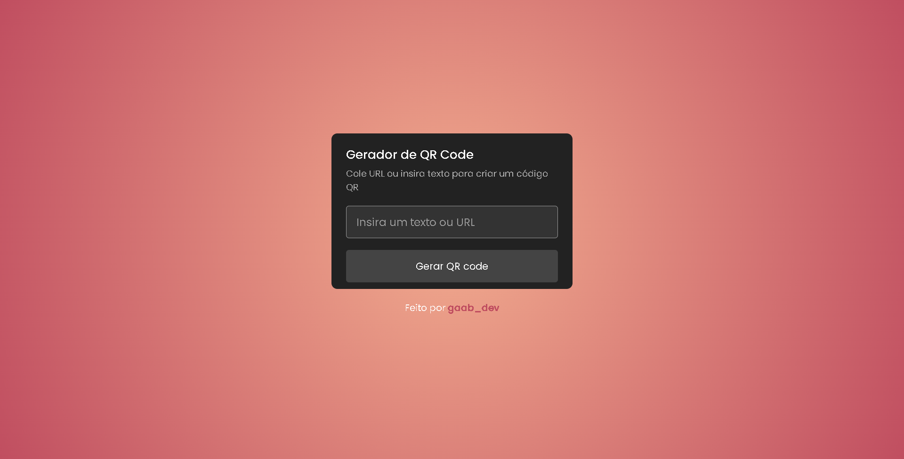

<h1 align="center"> Gerador de QR Code </h1> 

### 💻 Projeto 
Um simples projeto  de Gerador de QR Code Web Responsivo. 

### ⚙ Funcionalidades
- Gera QR Code personalizado
- Projeto responsivo

### 🚀 Tecnologias
- HTML
- CSS
- JavaScript